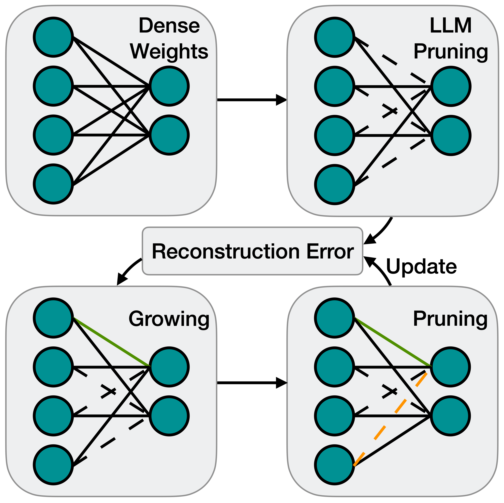
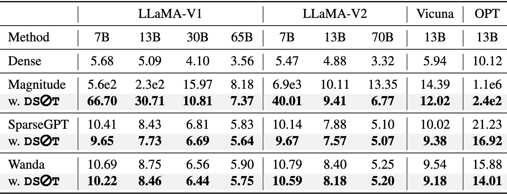
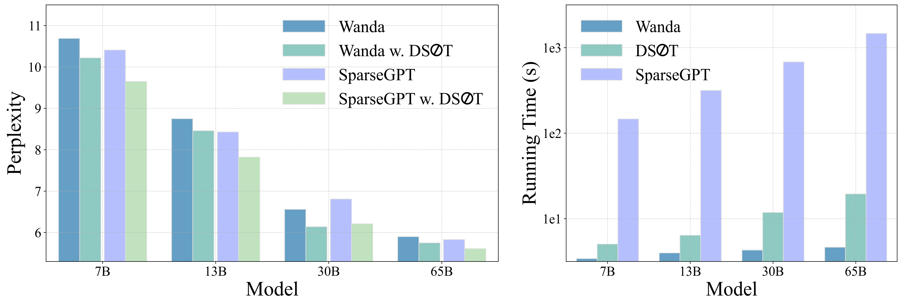

# [Dynamic Sparse No Training: Training-Free Fine-tuning for Sparse LLMs](https://arxiv.org/abs/2310.08915)

Pytorch implementation of our paper accepted by ICLR 2024 -- **DSnoT** (**D**ynamic **S**parse **no** **T**raining).
<p align="center">
  
</p>

## Abstract

The ever-increasing large language models (LLMs), though opening a potential path for the upcoming artificial general intelligence, sadly drops a daunting obstacle on the way towards their on-device deployment. As one of the most well-established pre-LLMs approaches in reducing model complexity, network pruning appears to lag behind in the era of LLMs, due mostly to its costly fine-tuning (or re-training) necessity under the massive volumes of model parameter and training data. To close this industry-academia gap, we introduce Dynamic Sparse No Training (DSnoT), a training-free fine-tuning approach that slightly updates sparse LLMs without the expensive backpropagation and any weight updates. Inspired by the Dynamic Sparse Training, DSnoT minimizes the reconstruction error between the dense and sparse LLMs, in the fashion of performing iterative weight pruning-and-growing on top of sparse LLMs. To accomplish this purpose, DSnoT particularly takes into account the anticipated reduction in reconstruction error for pruning and growing, as well as the variance w.r.t. different input data for growing each weight. This practice can be executed efficiently in linear time since its obviates the need of backpropagation for fine-tuning LLMs. Extensive experiments on LLaMA-V1/V2, Vicuna, and OPT across various benchmarks demonstrate the effectiveness of DSnoT in enhancing the performance of sparse LLMs, especially at high sparsity levels. For instance, DSnoT is able to outperform the state-of-the-art Wanda by 26.79 perplexity at 70% sparsity with LLaMA-7B. Our paper offers fresh insights into how to fine-tune sparse LLMs in an efficient training-free manner and open new venues to scale the great potential of sparsity to LLMs. 

We are open to any suggestions and discussions and feel free to contact us through yuxinzhang@stu.xmu.edu.cn or liruizhao@stu.xmu.edu.cn.

## Install

```sh
git clone https://github.com/zyxxmu/DSnoT.git

cd DSnoT

conda env create -f environment.yaml
```

## Usage

Here is an example command for DSnoT finetuning sparse llama-7b base wanda, to achieve unstructured 50% sparsity.

```sh
CUDA_VISIBLE_DEVICES=0,1,2,3 python main.py \
    --model decapoda-research/llama-7b-hf \
    --prune_method DSnoT \
    --initial_method wanda \
    --sparsity_ratio 0.5 \
    --sparsity_type unstructured \
    --max_cycle_time 50 \
    --update_threshold 0.1 \
    --pow_of_var_regrowing 1
```

## Results

- WikiText-2 Perplexity comparison for sparse LLMs at 60\% sparsity rate.

- WikiText-2 Perplexity **(left)** and running time **(right)** of different methods for pruning
LLaMA at 60% sparsity rate.


## Related Project

[A Simple and Effective Pruning Approach for Large Language Models](https://github.com/locuslab/wanda)

[SparseGPT: Massive Language Models Can be Accurately Pruned in One-Shot](https://github.com/ist-daslab/sparsegpt)

## Citation

if you find this repo is helpful, please cite our paper:
```
@article{zhang2023dyna,
  title={Dynamic Sparse No Training: Training-Free Fine-tuning for Sparse LLMs},
  author={Yuxin Zhang, Lirui Zhao, Mingbao Lin, Yunyun Sun, Yiwu Yao, Xingjia Han, Jared Tanner, Shiwei Liu, and Rongrong Ji},
  year={2023}
}
```
